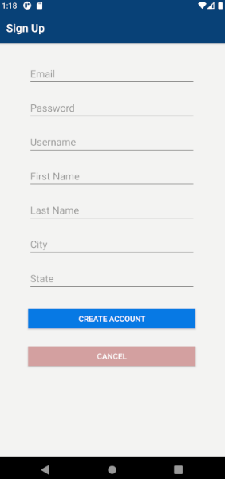

# `Timothy Negron - Projects`

### `About Me`

Hello World, my name is Timothy Negron. I love to write code.
I was born and raised in the Bronx, NY. I joined the U.S. Army
after High School and served for over 6 years. During my service,
I deployed to Afghanistan twice in support of Operation Enduring Freedom
and earned the rank of Sergeant. After the Army, I pursued a 
Bachelor of Science in Computer Programming and Information Systems. I graduated with Honor's and then earned a Cisco Certified Network Associate Routing and Switching certification.
I'm now focusing on creating projects so that I can increase my
skill level as a coder and learn about new technologies.

---

### `Project Rhythm Crowd`

* A social media music platform for independent music artist.
* Source: [Project Rhythm Crowd Repo](https://github.com/timothynegron/project-rhythm-crowd)

RecyclerView | **Cloud Firestore** | **Firebase Authentication** | Java | XML |  Fragments | 

---

### `Countries Database Interface`

* **A WPF graphical interface that gives users access to a SQL server database containing data related to countries.**
* Source: [Countries Database Interface Repo](https://github.com/timothynegron/country-db-interface)

WPF | **SQL Server** | C# | XAML | DLL | OpenFileDialog |

---

This is a temporary holding place for my projects till my website is complete.