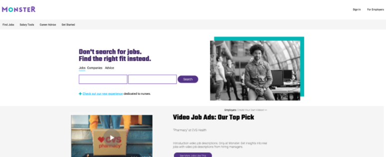
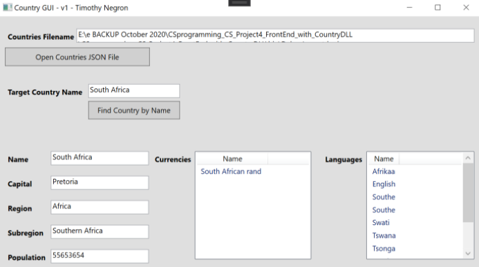
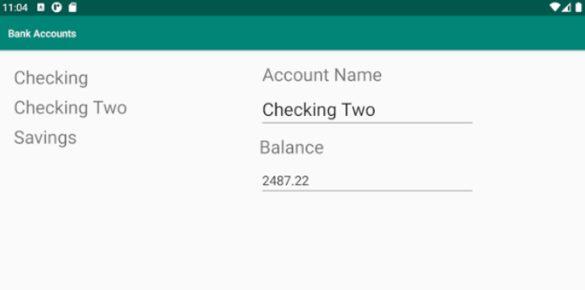
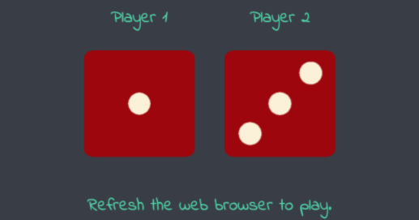
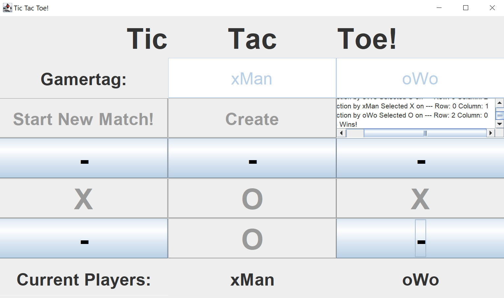
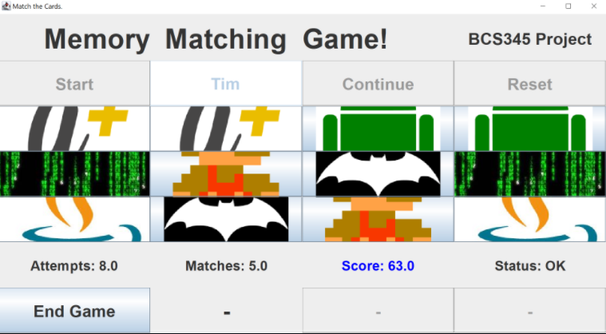
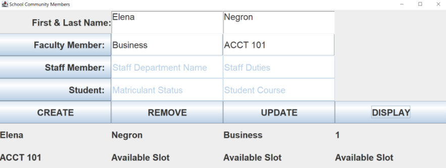

# I'm Timothy Negron

    

        I love to write code. This page is a collection of stuff I've made with code.
    

---

## Project Rhythm Crowd

**A social media music platform for independent music artist.**
* Source: [Repository - Project Rhythm Crowd](https://github.com/timothynegron/project-rhythm-crowd)
* Built With: RecyclerView / **Cloud Firestore** / **Firebase Authentication** / Java / XML /  Fragments 

    
    
    

---

## Countries Database Interface

**A WPF graphical interface that gives users access to a SQL server database containing data related to countries.**
* Source: [Repository - Countries DB Interface](https://github.com/timothynegron/country-db-interface)
* Built With: WPF / **SQL Server** / C# / XAML / JSON / DLL / OpenFileDialog

---

## Copy Monster Front Page

**I used HTML and CSS to copy Monster's entire front page.**
* Source: [Repository - Monster Front Page](https://github.com/timothynegron/copy-monster-front-page)
* Web Link: [Copy Monster Front Page](https://timothynegron.github.io/copy-monster-front-page/)
* HTML / CSS / **Flexbox**

---

## Countries JSON Dataset Interface

**A WPF interface that gives users access to a dataset related to countries that are stored on a JSON file.**

* Source: [Repository - Country JSON Interface](https://github.com/timothynegron/country-json-interface)
* Built With: C# / XAML / WPF / DLL / ListBox / **JSON Serializer and Deserializer** / OpenFileDialog

    

---

## Twitter Gridder

**I used CSS Grid to re-create the SpaceX Twitter profile page.**

* Source: [Repository - Twitter Gridder](https://github.com/timothynegron/twitter-gridder)
* Web Link: [Twitter Gridder](https://timothynegron.github.io/twitter-gridder/)
* Built With: **CSS Grid** / HTML5 / CSS3

    

---

## Bank App

**A simple android bank app for experimenting with RecyclerView and Data Singleton.**

* Source: [Repository - Bank App Android](https://github.com/timothynegron/bank-app-android)
* Built With: Java / Android Studio / RecyclerView / Fragments / Data Singleton

---

## Dice Game

**Simple dice game I made to practice integrating JavaScript to a webpage**

* Source: [Repository - Dice Game]()
* Web Link: [Dice Game](https://timothynegron.github.io/dice-game/)
* Built With: JavaScript

    

---

## Tic Tac Toe

**I used Java to make a Tic Tac Toe game.**

* Source: [Repository - Tic Tac Toe]()
* Built With: Java / JFrame / JPanel

---

## Card Matching

**A card matching game built with Java.**

* Source: [Repository - Card Matching](https://github.com/timothynegron/card-matching)
* Built With: Java / JFrame / JPanel

---

## School Personnel Portal

* Source: [Repository - School Personnel Portal](https://github.com/timothynegron/school-personnel-portal)
* Built With: Java / JFrame / JPanel

